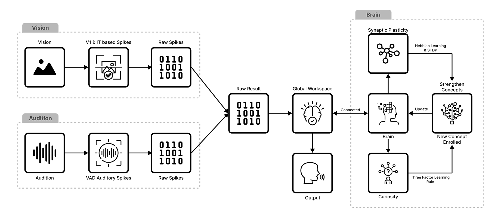
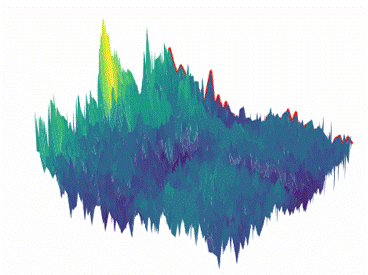
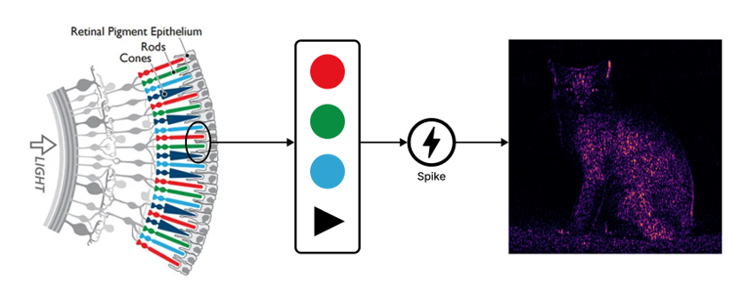
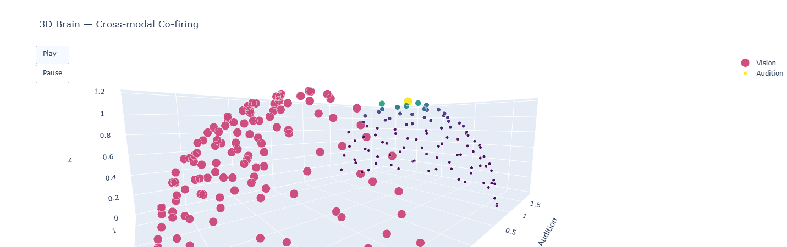

# BabyAI — Biologically Plausible, Curiosity-Driven Multisensory AI
Master’s Final Project Thesis — Staffordshire University  
Author: Syed Kumail Haider

---

## Overview

BabyAI is a mechanistic, biologically inspired learning system designed to mimic early infant learning through multisensory integration.  
The system unifies auditory and visual processing, Hebbian and STDP plasticity, dopamine-like curiosity modulation, and persistent prototype-based memory into a single, online learning framework.

BabyAI learns in real time, forms neural-like representations, consolidates memory through temporal alignment, and performs recognition with calibrated confidence and open-set abstention.

This implementation is based on the MSc thesis:  
**“Biologically Plausible Curiosity-Driven Multisensory Learning in BabyAI.”**

---

## Visuals

### Human Ear Pipeline — Cochlear Spikes and Spectral Features

### Voice Gradient — Frequency over time based spikes

### Vision Pipeline — V1 Energy Maps

### Neural Activity — Internal Neuron Firing

---

## Key Features

### Auditory Learning
- Tonotopic frequency mapping  
- Sparse spike/event generation  
- Hebbian and STDP plasticity  
- Dopamine-like curiosity modulation  
- Prototype formation with DTW and EMA  
- Open-set recognition with calibrated threshold  
- Analysis-by-synthesis waveform reconstruction  

### Vision Learning
- Retina Difference-of-Gaussian preprocessing  
- V1 Gabor orientation/scale filters  
- Compact invariant IT-like descriptor  
- Persistent prototype memory  
- Cross-modal similarity-driven co-activation  

### Curiosity Modulator
- Integrates prediction error, entropy, and deviation from prototypes  
- Produces phasic/tonic dopamine-like modulation  
- Safety gates prevent unstable plasticity  

### Memory System
- Persistent JSON-based *brain store*  
- Stores prototypes, STDP weights, hyperparameters, and evolution history  
- Includes sparsification, decay, and reconstruction invariants  

---

## System Architecture

1. **Auditory Front-End**  
   STFT → tonotopic mapping → spike proxy → curiosity-modulated learning.

2. **Vision Front-End**  
   DoG → Gabor filters → invariant IT-like representation.

3. **Plasticity Engine**  
   Hebbian + STDP + neuromodulatory (dopamine-like) learning.

4. **Prototype Memory**  
   Temporal alignment via DTW, EMA consolidation, homeostasis.

5. **Recognition & Calibration**  
   Similarity scoring + temperature scaling + open-set abstention.

6. **Synthesis Pathway**  
   Prototype → spectral shaping → additive sinusoid rendering.

7. **Visualization Layer**  
   Tonotopic maps, V1 feature maps, neuron firing graphs.

---

## Usage

### Learning (Enrollment)
- Provide audio or image input  
- Features are extracted and aligned  
- Curiosity evaluates novelty and generates dopamine-like modulation  
- Prototype memory updates  
- Visualization windows display neural processing

### Recognition
- Compares query against prototypes  
- Temperature-calibrated similarity scoring  
- Abstains for unknown (open-set) inputs  

### Synthesis
- Reconstructs audio from learned prototypes  
- Enables internal self-evaluation loop  

---

## Experimental Highlights

- Strong sensitivity to novelty and deviance  
- Prototype consolidation without catastrophic forgetting  
- Invariance to speaking-rate variation  
- Accurate open-set rejection  
- Cross-modal co-activation consistent with Global Workspace dynamics  

---

## Limitations

- Vision module limited to V1-level features  
- Audio synthesis basic (additive sinusoid)  
- Workspace controller is minimal  
- No embodiment or motor feedback yet  

---

## Future Work

- Richer hierarchical vision (V2 → V4 → IT)  
- Improved temporal modeling in audition  
- Full Global Workspace implementation  
- Neuromorphic deployment  
- Advanced speech synthesis  
- Embodied active perception  
- Additional sensory modalities  

---

## Citation

**Haider, S. K. (2025).**  
*Biologically Plausible Curiosity-Driven Multisensory Learning in BabyAI.*  
MSc Robotics and Smart Technologies, Staffordshire University.

---

## Acknowledgements

Supervised by **Dr. Masum Billah**.  
All biological and computational design details are documented in the thesis.

